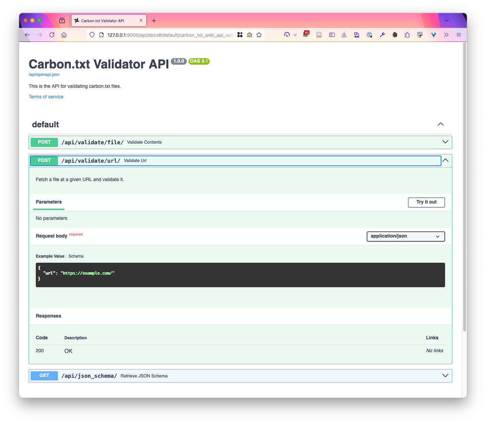

# Carbon.txt Validator

This repository holds the code for the Green Web Foundation carbon.txt validator. It reads carbon.txt files and validates them against a spec defined on http://carbontxt.org. We use it to host active development of this validator and to manage/discuss technical issues.


When you [validate a carbon.txt file on the carbon.txt website](https://carbontxt.org/tools), it is using the API offered by this validator.

## What is the carbon.txt project?

If you are new to the carbon.txt project, you can think of it a project to sustainability data easier to discover and use on the web. Carbon.txt is a single place to look on any domain – */carbon.txt* – for public, machine-readable, sustainability data relating to that company.

[Visit the Green Web Foundation website for a full overview](https://www.thegreenwebfoundation.org/tools/carbon-txt/).

# Usage

There are two main ways to use the validator - as a command line tool, via the CLI, or as a web servier, via the HTTP API.

## With the CLI

Run a validation against a given domain, or file, say if the file is valid TOML,
and it confirms to the carbon.txt spec.

The following commands assume you are working in a virtual environment:

```shell
# parse the carbon.txt file on default paths on some-domain.com
carbon-txt validate domain some-domain.com

# parse a remote file available at https://somedomain.com/path-to-carbon.txt
carbon-txt validate file https://somedomain.com/path-to-carbon.txt

# parse a local file ./path-to-file.txt
carbon-txt validate file ./path-to-file.txt

# pipe the contents of a file into the file validation command as part of a pipeline
cat ./path-to-file.com | carbontxt validate file
```

## With the HTTP API

You can also validate carbon.txt files sent over an HTTP API.

```shell
# run the carbon-txt validator as a server using the default django server. Not for production
carbon-txt serve
```

This will start an local server that by default listens on http://127.0.0.1:8000, looking something like thr screenshot below:



### Further guidance on usage

Please see the [dedicated documentation site for the validator](https://carbon-txt-validator.readthedocs.io/en/latest/) for details about how the validator works, and how to install it, extend it, and to deploy it.

# Installation

> [!TIP]
> See more detailed [guidance on installation on the dedicated valiator docs site](https://carbon-txt-validator.readthedocs.io/en/latest/installation.html).

## Using `pip`

You can install the latest release of the carbon.txt validator using pip. we assume that the carbon.txt validator is run inside a virtual environment. [Learn more about virtual environments with Python](https://realpython.com/python-virtual-environments-a-primer/).

```
python -m pip install carbon-txt
```


## Using `uv`

If you are not using virtual environments directly, you can use it with
[uv](https://docs.astral.sh/uv/). This is the recommended way to run the
project, and the one we actively support.

Add carbon-txt to a project with `uv add`:

```
uv add carbon-txt
```

You can now run the command line tool with `uv run carbon-txt`

## Running outside a project

If you have uv installed, you can run the command line tool like so:

```
# check a file
uv tool run carbon-txt validate ./path/to/file

# run a server
uv tool run carbon-txt serve
```

This will download the latest published version from [Pypi](https://pypi.org/) and run the corresponding CLI command

Further details are in the [dedicated docs on read the docs for the validator](https://carbon-txt-validator.readthedocs.io/en/latest/index.html)


## More on the Carbon.txt project


### Further technical documentation

There are a number of places where we hold technical documentation, beyond the validator here. The best starting point to find what you're looking for is on [https://carbontxt.org/](https://carbontxt.org/).

The [issues sections](https://github.com/thegreenwebfoundation/carbon.txt/issues) of our main github repos is also a great source of help. You might find someone has already asked for help on the same issue and you’ll find an answer. We appreciate those that take the time to create public issues for this reason, it may help someone who encounters something similar after you.

### Where to raise a technical issue with the project

Technical issues can cover a broad range of things. We take this to mean:

- Reporting a bug or something not working as you expect.
- Suggesting a new feature or improvement that could be made.

Our project GitHub repos are generally the best place to raise technical issues like these. We have a number of repos that cover different aspects of our project. Here’s a summary of those and a link to the relevant issues part of that repo:

Extending the carbon.txt approach such as running your own validator service or creating plugins (this repository) - https://github.com/thegreenwebfoundation/carbon-txt-validator/issues

Using the carbon.txt validator tools on our public website - https://github.com/thegreenwebfoundation/carbon-txt-site/issues

Developing the carbon.txt syntax and specification - https://github.com/thegreenwebfoundation/carbon.txt/issues

If you are unsure of the best repo for your issue, please just make your best guess. We'll move it if we think it necessary.


### Collaborate, donate or fund this project

We are always open for discussions about how people can contribute back to the development and success of this tool through collaboration or financial donations. Please use the [Green Web Foundation support form](https://www.thegreenwebfoundation.org/support-form/) to let us know what you’d like to chat about.


### Commercial support

The Green Web Foundation offers commercial consulting on:

- using the carbon.txt validator to parse and process sustainability disclosures online,
- disclosing this information in a way that validators can pick up, by implementing carbon.txt files
- requesting disclosures from suppliers using the carbon.txt convention

For this, the fastest way to get a direct response is to use the [Green Web Foundation support form](https://www.thegreenwebfoundation.org/support-form/).
