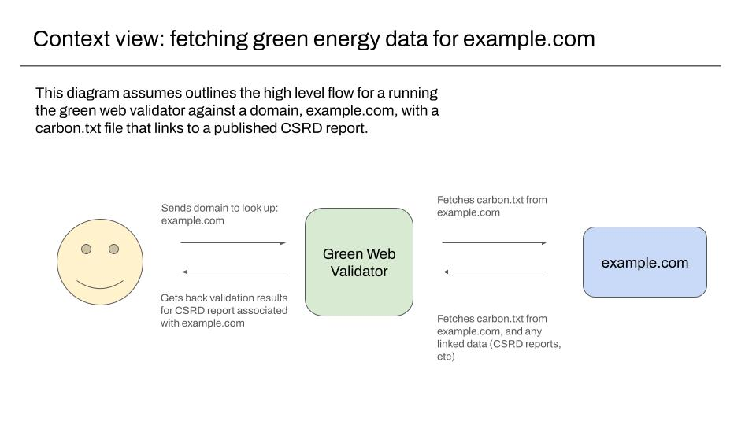
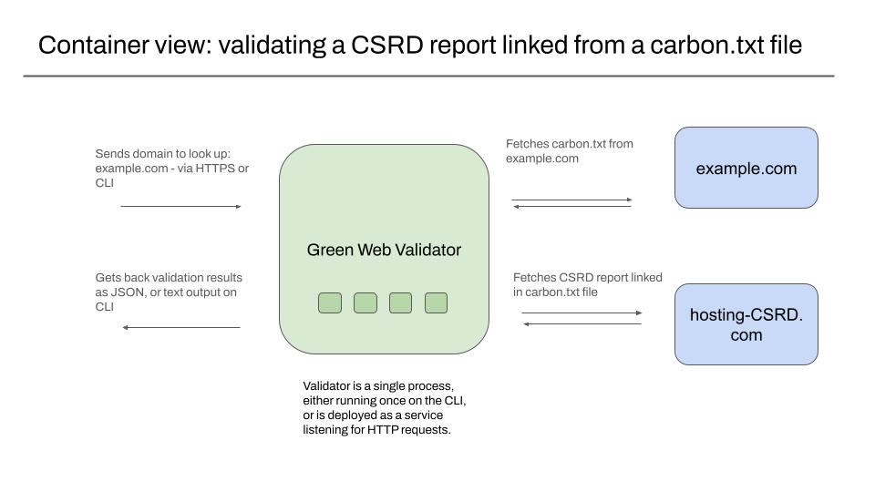
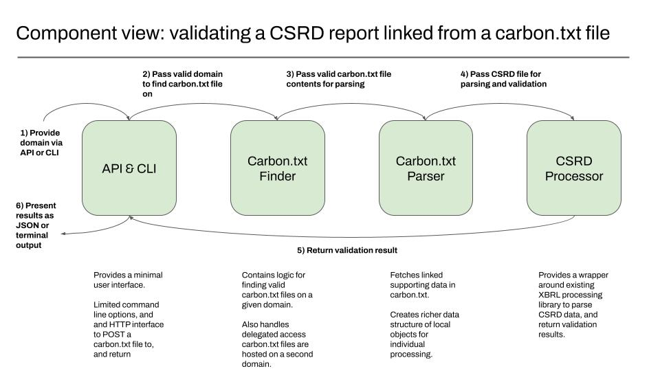
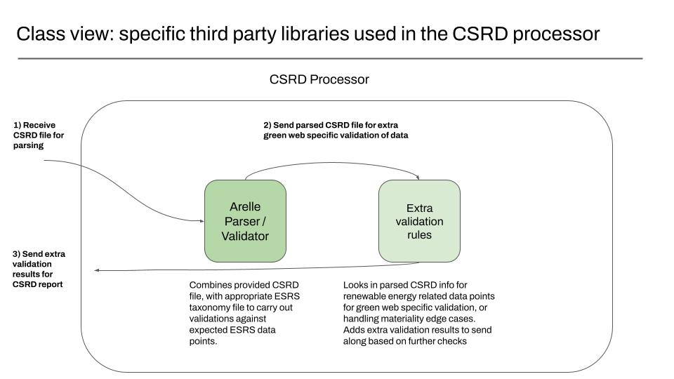

# Architecture

## How carbon.txt is designed.

The following diagrams use the C4 model for describing software architecture to describe how the Carbon.txt validator is designed. These are largely created usin

The C4 model broadly provides a set of views of part of a system increasing order of detail along the following lines:

1. context - a view of what the system does, intended to be readable by people not building the system
1. containers - a view of running proceses, used to help understand what might be deployed
1. componenents - a view of the significant parts in a container. usually
1. classes - a view inside a component of specific classes or objects in the system

For more, see [the C4 model for visualising software architecture](https://c4model.com/) website.

All of these images are from [the publicly accessble google slide deck for Carbon.txt diagrams](https://docs.google.com/presentation/d/1ry6IvS7daZHN3bNLKckG0AjQOM1MtF7LSMWdZFY72Rs/edit#slide=id.g30475fbe3bd_0_220).

### Context View

The 

### Containers

The validator is designed to work as a single deployable unit as a server, to provide a service via an API, or be called using a command line interface, to allow for being run in batch jobs.

### Components

The carbon.txt validator is split into a series of components, with clear
divisions of responsibility

- **Finders**: Finders are responsible for accepting a domain or URI, and
  resolving it to the final URI where a carbon.txt file is accessible, for
  fetching and reading.
- **Parsers**: Parsers are responsible for parsing carbon.txt files, then making
  sure they valid and conform to the required data schema.
- **Processors**(s): Processors are responsible for parsing specific kinds of
  linked documents, and data, and returning a valid data structure.

In more detail.

### Finders

The Finder is responsible for locating and fetching a files, either from remote sources or from local paths on the same machine. It's the only part of the system that makes outbound network requests. They are expected to make DNS lookups, and HTTPS requests, local path resolution, and they are responsible for handling related retry and failure handling logic.

They are responsible for sending along strings or datastructures to Parsers and Processors. When links to remote files exist in parsed carbon.txt files, the finders handle finding and fetching too.

The intention is to keep the logic for similar tasks related to finding and retrieving file in one place.`

### Parsers

Parsers in this context are primarily responsible for checking that a datastructure, or contents of a retrieved file meet the expected format and structure.

They don't make network requests. Where a carbon.txt file links to specific kinds of resources like CSRD reports, or external webpages, they delegate to the corresponding processor for that kind of resource.

Parsers only work with strings of datastructures and are not responsible for any further IO.

### Classes

#### Processors

The CSRD Processor uses [Arelle](https://arelle.readthedocs.io/), an open source library for working with XBRL documents, to turn XBRL-formatted CSRD reports into datastructures that can be manipulatd in Python, and that can be checked for the existence of specific data points. The validation results are returned in API respones, or the output in CLI commands.
