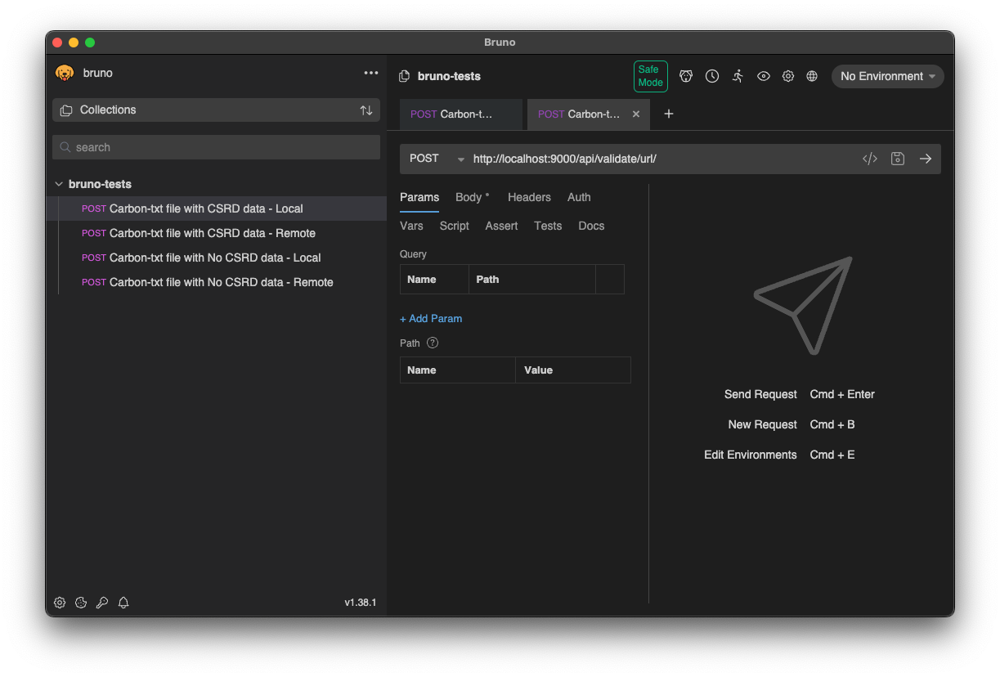
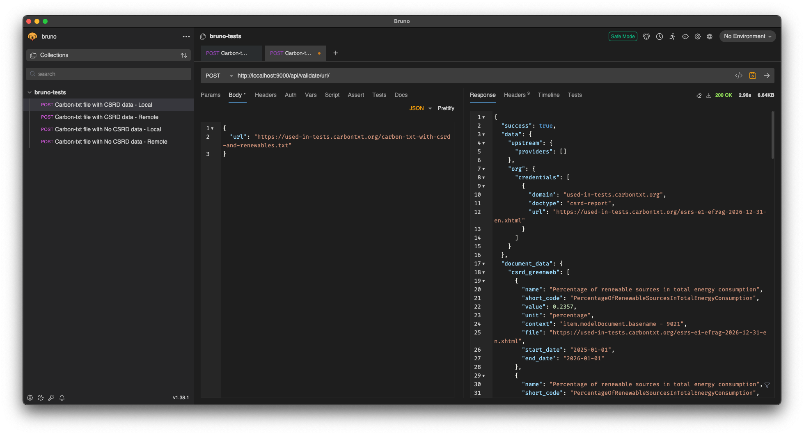

# Installation

The carbon-txt validator project uses the Pyproject format to track software library dependencies, so should work with most python tools for managing dependencies, like `pip`.

## The supported approach - using `uv` and `just`

With that in mind, the supported, 'golden path' approach is to use the `uv` tool from Astral for managing dependencies, and `just` for automating common tasks.

We recommend and support `uv`, because it helps address many of the common issues managing different versions of Python, both in developmnent and in production, and is actively supported by people working on it full time.

We recommend `just`, as it offers a maintainable way to document and automate common tasks during development, and is both well documented, and actively maintained.

### Installing just and installing uv

You can install uv with a single one-line command on most systems:

```shell
curl -LsSf https://astral.sh/uv/install.sh | sh
```

There are other supported ways to install `uv` documented on Astral's installtion page for the project.


You can also install `just` with a similar one-liner.

```shell
curl --proto '=https' --tlsv1.2 -sSf https://just.systems/install.sh | bash -s -- --to DEST
```

However, depending on your system, there may be an option that integrates `just` better with your setup - [please see the installation docs for more](https://github.com/casey/just?tab=readme-ov-file#installation).

### Developing with just

Once just and uv are set up, run `just` to see a list of tasks available for development:

```
just
```

You should see a list of tasks like this:

```
just --list
Available recipes:
    build               # clear the dist directory, and build the project, ready for publishing
    ci *options         # run the tests for a CI environment, generating a coverage report
    default             # list all the available commands
    docs *options       # generate docs into the docs/_build/html directory
    docs-watch *options # generate docs, serve the locally over http, and update them when files change
    env                 # show the environment variables available
    publish *options    # publish the built python project to pypi
    run-cli *options    # invoke the cli, as if you were running `carbon-txt` after downloading the package
    serve *options      # serve the django app, using the django manage.py script
    test *options       # run all the tests, with the ability to pass in options
    test-watch *options # run all the tests, and re-run them when files change
```

You can then run `just test` to run the tests, or to simulate running the CLI app, `just run-cli`.

This will also default to running each taks with any environment variables defined in `.env` available. you can override this by passing in a path to a custom environment file if need be:

```
just --dotenv-path ./path/to/custom.env YOUR_CHOSEN_TASK
```

# Running tests

Run `just test` for a one off invocation of pytest.

Run `just test-watch` to run pytest every time files are updated.

By default, running this will also generate a test coverage report, that can be picked up by your editor to display code that still needs test coverage ([see an example for VS code](https://github.com/ryanluker/vscode-coverage-gutters))

### Testing out the API with Bruno, a graphical API testing tool

If you want to test responses from the API, the automated tests written in Python in this project exercise most of, if not all of the API endpoints.

If you prefer a GUI based API tester though, we have a set of tests for use with [Bruno - an open source Postman-like API testing tool](https://www.usebruno.com/).

The API tests are `tests/bruno-tests`. From `File > Open Collection:` then choose the `bruno-tests` directory. You should see a list of tests like so:



You can then open a test and trigger the API test with `cmd + Enter`


