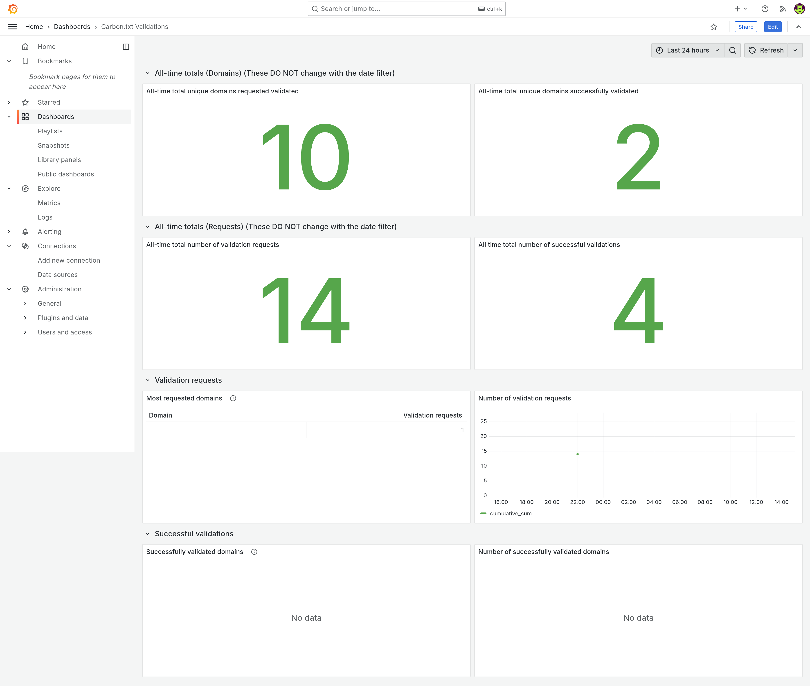

# Runbook

```{admonition} Warning
:class: warning
This is content is primarily aimed at an internal audience of staff at the Green Web Foundation operating the carbon.txt API service.
```


## How the Green Web Foundation deploys the validator

We use the following Ansible playbook ourselves to deploy the latest version of the API to a given server.

It assumes you have a dedicated user set up to run the service running on a linux server, called `deploy`, and sets up a folder structure to run the service, using the tool `uv` to run the latest published version of the package.

It refers to a django config file accessible in the same folder as where the command is run.

It also sets up a systemd service to run the service behind a reverse proxy server like Nginx or Caddy (in our case, we use Caddy). Systemd handles restarts and failures, and collects logs to be sent to a centralised logging server.

This playbook is designed to be run from a developer's server, or as part of an internally managed github action.

### Deployment


```{literalinclude} ./../ansible/playbooks/deploy.yml
:language: yaml
```


The carbon_txt_api file is the file run by Systemd. Every time this is run, it pulls down the latest published version of the carbon-txt package and runs the `serve` command.

It also uses a `local_config` file - this can be used to add extra configuration.

```shell
# written to /var/www/carbon-txt-api.greenweb.org/run_carbon_txt_api.sh

# Inject any extra libraries needed for database connectivity here, eg mysqlclient;
/path/to/bin/uv tool --with mysqlclient run carbon-txt@latest serve \
--django-settings local_config \
--port <PORT> \
--host <HOST> \
--server granian \
--migrate
```

The local config file is templated out into the the same directory as where the command is run from. and the same directory as the environment variables file:

```shell
# written to /var/www/carbon-txt-api.greenweb.org/local_config.py

# local_config.py

from carbon_txt.web.config.settings.production import *  # noqa

# extra settings here
EXTRA_CONFIG = True
SOME_SETTING = "some value"

```

Environment variables are provided through a env file:

```shell
# carbon_text_api_dotenv.sh
# templated out to /var/www/carbon-txt-api.greenweb.org/.env

DATABASE_URL="{{ database_url }}"

```


The templated out Systemd service file looks like the example below. It uses the `run_carbon_txt_api.sh` script to run the service. Any required environment variables are placed in the `.env ` environment file.

```shell
# written to /etc/systemd/system/carbon_txt_api.service

# {{ ansible_managed }}
# Last run: {{ template_run_date }}

[Unit]
Description=Carbon.txt API
Documentation=https://carbon-txt-validator.readthedocs.io/en/latest/
Wants=network-online.target
After=network-online.target
[Service]
ExecStart=bash ./run_carbon_txt_api.sh
ExecReload=/bin/kill -s HUP $MAINPID
WorkingDirectory={{ project_path }}/
EnvironmentFile={{ project_path }}/.env
User={{ service_user }}
Group={{ service_user }}
KillMode=process
KillSignal=SIGTERM
Restart=on-failure
[Install]
WantedBy=multi-user.target

```

## Operating the front end

See the README on the [carbon-text-site github repository](https://github.com/thegreenwebfoundation/carbon-txt-site), for instructions on developing, operating and deploying the front end that consumes the API offered by the carbon.txt validator.


## Seeing Logs

Logs from the carbon txt validator service, when deployed in Green Web Foundation infrastructure are aggregated by Systemd, and forwarded to a Loki centralised logging server. These logs can be queried at [grafana.greenweb.org](https://grafana.greenweb.org) - filter logs by the systemd unit `carbon_txt_api`, using the label filter `{unit="carbon_txt_api.service"}`
Anonymised information on the domains validated is also logged to the django database, in the table `validation_logging_ValidationLogEntry`.

You can see these statistics in the [carbon.txt validations grafana dashboard](https://grafana.greenweb.org/d/deh0shbr55340f/carbon-txt-validations):

.

The large numbers at the top of the dashboard show figures for all time, and do not alter with the time range selected - They show the number of unique domains requested for validation (plus the number of those domains which validates succesfully), and on the next row, the total number of validation requests (and the number of those which were succesful).

Below these, the tables and graphs which provide an overview for the selected time range: A breakdown of the validations requested during the selected time period by domain validated, plus a graph of the total, cumulative number of validations requested, and the same, but for succesful validations: a list of domains which were succesfully validated, plus a graph of the cumulative total number of succesful validations, over time.


## Monitoring, and exception tracking

We use Sentry's suite of hosted monitoring tools for tracking exceptions, performance, and uptime. See [greenweb.sentry.io](https://greenweb.sentry.io/).
